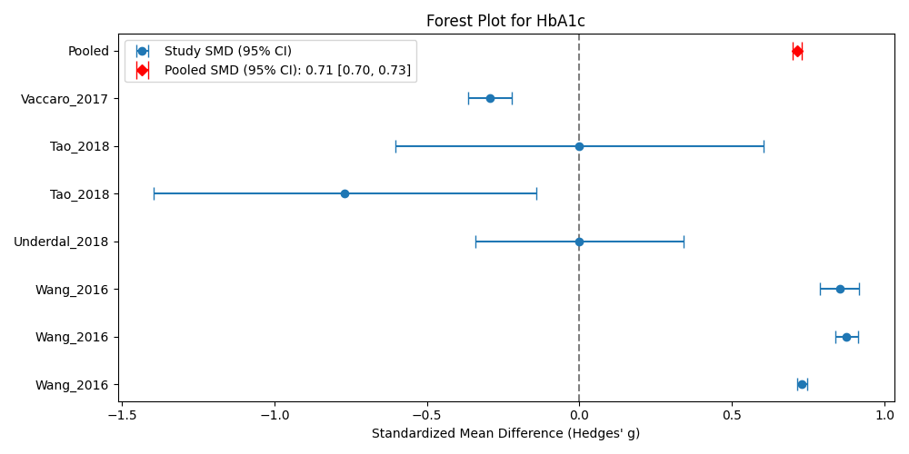

# Meta-Analysis Project Documentation

*Generated on: 2025-10-24 07:40:52*

**Creator:** krisztian.sugar@frogs.hu "budapest" team

## 1. Input Topic

**Topic:** Association of metformin use and cancer incidence

## 2. Database Search

Due to missing license I was only using PubMed API.

**Search queries generated by LLM:**
1. `(metformin OR Glucophage OR biguanide OR dimethylbiguanide) AND (cancer OR neoplasm OR carcinoma OR malignancy OR oncogenesis OR incidence OR risk reduction OR tumor) NOT (systematic review[pt] OR meta-analysis[pt] OR review[pt])`
2. `('Metformin'[MeSH] AND ('Neoplasms'[MeSH] OR 'Cancer Incidence'[MeSH]) AND ('Cohort Studies'[MeSH] OR 'Case-Control Studies'[MeSH])) NOT (systematic review[pt] OR meta-analysis[pt] OR review[pt])`
3. `(metformin[tiab] AND (cancer incidence[tiab] OR neoplasm risk[tiab])) NOT (systematic review[pt] OR meta-analysis[pt] OR review[pt])`
4. `(metformin OR Glucophage) AND (cancer OR neoplasm) AND (cohort study[pt] OR case-control study[pt] OR longitudinal studies[mesh]) NOT (systematic review[pt] OR meta-analysis[pt] OR review[pt])`
5. `(metformin OR biguanide) AND (glucose metabolism OR insulin resistance OR AMPK pathway) AND (cancer OR tumor OR malignancy) NOT (systematic review[pt] OR meta-analysis[pt] OR review[pt])`
6. `(metformin AND (cancer OR neoplasm) AND incidence) AND (2014:2024[dp]) NOT (systematic review[pt] OR meta-analysis[pt] OR review[pt])`
7. `(metformin AND cancer incidence) AND (randomized controlled trial[pt] OR clinical trial[pt]) NOT (systematic review[pt] OR meta-analysis[pt] OR review[pt])`

**Search results:** 513 articles retrieved

## 3. Abstract-Based Pre-filtering

Based on fetched PubMed metadata, articles were pre-filtered using LLM analysis of abstracts.

**GOOD CANDIDATES should have:**
- Clear randomized controlled trial (RCT) or systematic review methodology
- Well-defined study population and intervention
- Measurable primary and secondary outcomes
- Statistical analysis with effect sizes, confidence intervals, or p-values
- Clinical relevance and significance
- Adequate sample size
- Clear inclusion/exclusion criteria

**BAD CANDIDATES typically have:**
- Case reports or case series (small n<10)
- Editorial comments, letters, or opinions
- Animal studies or in vitro studies only
- Lack of control groups
- Unclear methodology or outcomes
- Preliminary or pilot studies without sufficient power
- Studies with major methodological flaws
- Conference abstracts without full methodology

**Sample abstract-based classifications:**

**Example 1 - GOOD CANDIDATE:**
- PMID: 39560490
- Classification: Good Candidate
- Confidence Score: 0.95
- Reasons: "['Retrospective analysis of two clinical cohorts (human NSCLC patients) with clear clinical outcomes (RFS, PFS, OS).', 'Utilizes defined statistical methods (Hazard Ratio, Confidence Interval) suitable for meta-analysis.']"

**Example 2 - BAD CANDIDATE:**
- PMID: 35378172
- Classification: Bad Candidate
- Confidence Score: 1.0
- Reasons: "['Preclinical study utilizing murine (mouse) models exclusively.', 'Focuses on mechanistic outcomes (T-cell function, transcriptomic analysis) rather than human clinical endpoints (OS, PFS).']"

**Result:** 242 articles remained after abstract filtering

## 4. Full-Text Article Download

As lack of license only publicly available open access articles were downloaded.
Download attempted using PubMed API, with fallback to DOI link following.

**Result:** 178 articles successfully downloaded

## 5. Article Classification

Remaining full-text articles were classified one-by-one using LLM analysis:

**Classification categories:**
- `article_type`: Article type classification
- `candidate_meta_analysis`: Suitability for meta-analysis
- `cochrane_bias`: Cochrane bias risk assessment
- `data_type`: Type of data presented
- `species`: Species studied
- `study_type`: Study design type
- `clinical_test`: Clinical tests/measurements
- `cohort`: Cohort characteristics

Each classification includes evidence references from the source text.

### 5.1. Full-Text Classification for Meta-Analysis Candidacy

Based on the full text, each article was evaluated to determine if it contains any "no-go" stop words or criteria that would exclude it from meta-analysis. The LLM assessed each article's candidacy using the `candidate_meta_analysis` classifier.

**Classification criteria:**
- Articles with clear methodology, control groups, and quantifiable outcomes are marked as CANDIDATE
- Articles with case reports, editorials, reviews without original data, or methodological flaws are marked as NOT_A_CANDIDATE
- Confidence levels (High, Medium, Low) indicate the certainty of the classification

**Sample classifications:**

**Example 1 - CANDIDATE (High Confidence):**
- PMID: 37225730
- Classification: CANDIDATE
- Confidence: High
- Assessment: "The study meets all primary assessment criteria. It is a retrospective cohort study with defined comparative groups (VFI tertiles, metformin use) and provides robust quantitative data (HRs with 95% CIs) for survival outcomes (RFS and OS). It is strongly suitable for inclusion in a quantitative meta-analysis."

**Example 2 - NOT_A_CANDIDATE:**
- PMID: 40105683
- Classification: NOT_A_CANDIDATE
- Confidence: High
- Assessment: "The document is a clinical practice guideline/consensus report (secondary literature) and therefore fails the primary criterion requiring original quantitative research. It is unsuitable for inclusion in a quantitative meta-analytic synthesis."

**Result:** 115 articles confirmed as candidates for meta-analysis after full-text review

### 5.2. Full-Text Classification for Study Type

Based on the full text, each article was evaluated to determine if it contains any "no-go" stop words or criteria that would exclude it from meta-analysis. The LLM performed study type classification to categorize the research design.

**Study type classifications:**
- Randomized Controlled Trial (RCT)
- Cohort Study
- Case-Control Study

**Sample study_type classifier results:**

**Example 1 - study_type classifier result:**
- PMID: 36581893
- Classification: "Randomized Controlled Trial"
- Confidence: "High"
- Evidence: "The study is a pooled analysis of data derived from two separate clinical trials: the Reach for Health Study (RFH) and the MetBreCS trial. The Methods section explicitly states that participants were "randomly assigned to metformin... or placebo administration" and describes both source trials as "randomized, double-blind, placebo-controlled trials." The core methodology involves an interventional design where participants were prospectively allocated to an intervention group (metformin) or a comparator group (placebo) using random assignment, which aligns precisely with the definition of a Randomized Controlled Trial."

**Example 2 - study_type classifier result:**
- PMID: 34629300
- Classification: "Randomized Controlled Trial"
- Confidence: "High"
- Evidence: "The study is explicitly identified as a 'Randomized Phase II Study' in the title and the methods section. The core methodological characteristic is the random assignment of eligible, non-diabetic mCRPC patients into two groups: the intervention group (Docetaxel + Metformin) and the control group (Docetaxel + Placebo). Patients were 'randomly assigned at a 1:1 ratio.' The study followed participants prospectively from the point of randomization to assess outcomes like PSA response rate, Progression-Free Survival (PFS), and Overall Survival (OS), fulfilling all criteria for a Randomized Controlled Trial (RCT)."

## 6. Meta-Analysis Target Selection

Based on available cohorts and clinical tests, LLM analysis identified:
*"The most suitable clinical test for meta-analysis — one that provides the strongest evidence base and the widest coverage across studies."*

Due to limited time and resources, only 1 meta-analysis target was selected.

**Selected target:**
<code>json
{
  "selected_clinical_test": "Hemoglobin A1c (HbA1c)",
  "justification": "HbA1c is a standardized, widely reported laboratory test for long-term glycemic control, making it highly comparable across studies. It is clinically relevant for assessing the metabolic effects of interventions in diabetes, PCOS, and cancer-related metabolic dysregulation, all of which are heavily represented in the provided data.",
  "recommended_cohorts": [
    "Type 2 Diabetes Patients on Metformin",
    "Polycystic Ovary Syndrome (PCOS) Patients on Metformin",
    "Cancer Patients on Metformin"
  ]
}
</code>

## 7. Data Point Extraction

Based on the suggested meta-analysis target, all PDFs were processed individually to extract relevant data using multimodal Pro LLM.

**Sample extracted datapoints:**
<code>
 study_id   author_year country    population_type  sample_size_intervention  sample_size_control intervention_name  dose_mg_per_day  duration_days outcome_name biomarker_unit  intervention_baseline_mean  intervention_baseline_sd  intervention_post_mean intervention_post_sd  control_baseline_mean  control_baseline_sd  control_post_mean  control_post_sd  mean_difference  sd_difference  p_value effect_direction statistical_significance
 27496094   Paulus_2016     USA Type2_Diabetes_CRC                      2033                 2132         Metformin              NaN            NaN        HbA1c        percent                         6.9                       1.5                     NaN                  6.8                    1.5                  NaN                NaN              NaN              NaN            NaN      NaN              NaN                      NaN
 27496094   Paulus_2016     USA Type2_Diabetes_CRC                      2033                  818         Metformin              NaN            NaN        HbA1c        percent                         6.9                       1.5                     NaN                  6.2                    1.2                  NaN                NaN              NaN              NaN            NaN      NaN              NaN                      NaN
 32159875 Bartlett_2020      US     Type2_Diabetes                       172                  147         Metformin              NaN         5479.0        HbA1c        percent                         NaN                       NaN                     7.6                  NaN                    NaN                  NaN                6.7              NaN              0.9            NaN     0.11         increase                       no
</code>

## 8. Meta-Analysis Execution

LLM generated Python code to create Forest plots and statistical tables for the meta-analysis.

## 9. Cochrane Bias Risk Assessment

| PMID | Author Year | Randomization | Deviations | Missing Data | Measurement | Selection |
|------|-------------|---------------|------------|--------------|-------------|----------|
| 27496094 | Paulus_2016 | False | True | False | False | False |
| 32159875 | Bartlett_2020 | False | False | True | False | False |
| 32532851 | Wong_2020 | False | False | False | False | False |
| 36008432 | Jung_2022 | False | False | True | False | False |
| 28736111 | Peled_2017 | False | False | False | False | False |
| 34312687 | Elsayed_2021 | False | False | False | True | False |
| 23137378 | Qiu_2013 | False | True | False | False | False |
| 27026681 | Wang_2016 | False | False | True | True | False |
| 31815634 | Bromage_2019 | False | False | True | False | False |
| 34726324 | Cai_2022 | False | True | True | True | False |
| 29659896 | Underdal_2018 | False | False | True | False | False |
| 34006565 | Mueller_2021 | True | True | False | False | False |
| 26331456 | Mc Menamin_2016 | False | False | True | False | False |
| 38403687 | Zhou_2024 | False | True | True | False | False |
| 29482528 | Tao_2018 | False | True | True | False | False |
| 28917544 | Vaccaro_2017 | False | True | True | False | True |
| 26681720 | ORIGIN_Trial_Investigators_2015 | False | True | True | True | True |
| 31910850 | Fuchigami_2020 | False | True | False | False | False |

## 10. Results

**Topic:** Association of metformin use and cancer incidence

**Generated visualizations:**

**Statistical Results:**
<code>
Successfully loaded 28 rows from _extracted_datapoints.csv
Columns: ['study_id', 'author_year', 'country', 'population_type', 'sample_size_intervention', 'sample_size_control', 'intervention_name', 'dose_mg_per_day', 'duration_days', 'outcome_name', 'biomarker_unit', 'intervention_baseline_mean', 'intervention_baseline_sd', 'intervention_post_mean', 'intervention_post_sd', 'control_baseline_mean', 'control_baseline_sd', 'control_post_mean', 'control_post_sd', 'mean_difference', 'sd_difference', 'p_value', 'effect_direction', 'statistical_significance']
Outcomes available: ['HbA1c']
Studies: ['Paulus_2016' 'Bartlett_2020' 'Wong_2020' 'Jung_2022' 'Peled_2017'
 'Elsayed_2021' 'Qiu_2013' 'Wang_2016' 'Bromage_2019' 'Cai_2022'
 'Underdal_2018' 'Mueller_2021' 'Mc Menamin_2016' 'Zhou_2024' 'Tao_2018'
 'Vaccaro_2017' 'ORIGIN_Trial_Investigators_2015' 'Fuchigami_2020']

After cleaning missing values: 7 rows remaining
Outcomes with multiple studies: ['HbA1c']

==================================================
GENERATED CHARTS
==================================================
--- Meta-analysis for HbA1c ---
      author_year        intervention_name  dose_mg_per_day         g      se_g
11      Wang_2016                Metformin              NaN  0.730173  0.008653
12      Wang_2016                Metformin              NaN  0.876209  0.019148
13      Wang_2016                Metformin              NaN  0.852698  0.032329
16  Underdal_2018                Metformin           2000.0  0.000000  0.174746
21       Tao_2018  Saxagliptin + Metformin           2000.0 -0.769663  0.319828
22       Tao_2018              Saxagliptin              5.0  0.000000  0.308607
25   Vaccaro_2017             Pioglitazone             23.0 -0.292622  0.036543
Pooled SMD (Hedges' g): 0.714
Standard Error of Pooled SMD: 0.007
95% CI: [0.699, 0.728]

Chart: Forest Plot - HbA1c
Filename: _meta_analysis_forest_HbA1c.png
Description: Forest plot showing standardized mean differences for HbA1c with 95% confidence intervals
-----------------------------
</code>

