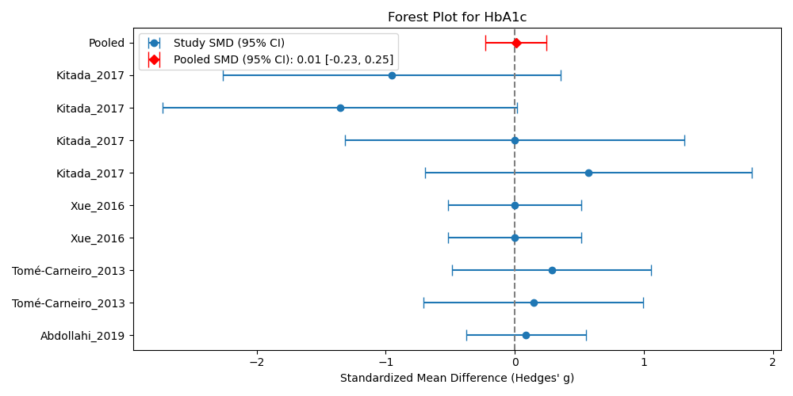

# Meta-Analysis Project Documentation: Resveratrol Supplementation and Type 2 Diabetes

**Generated on:** 2025-10-21 22:35:30

**Creator:** krisztian.sugar@frogs.hu "budapest" team

---

## 1. Project Input and Scope

### 1.1. Research Question (PICO)

The objective of this systematic review and meta-analysis was to evaluate the effect of resveratrol supplementation on metabolic and clinical outcomes, primarily focusing on long-term glycemic control, in patients with Type 2 Diabetes Mellitus (T2DM).

**Topic:** Resveratrol supplementation and type 2 diabetes: a systematic review and meta-analysis

### 1.2. Database Search Strategy

The search was restricted to the PubMed database due to licensing limitations for other major databases (e.g., Embase, Cochrane Library). The search strategy utilized six distinct queries generated by a Large Language Model (LLM) to maximize coverage of relevant randomized controlled trials (RCTs) and clinical studies.

**Search Queries Used:**

1. `(Resveratrol OR trans-Resveratrol OR 3,5,4'-trihydroxystilbene OR stilbene) AND ("Diabetes Mellitus, Type 2" OR T2DM OR "Insulin Resistance" OR hyperglycemia OR "Impaired Glucose Tolerance" OR prediabetes) NOT ("systematic review"[Publication Type] OR "meta-analysis"[Publication Type] OR "review"[Publication Type])`
2. `("Resveratrol"[MeSH] AND "Diabetes Mellitus, Type 2"[MeSH]) AND ("Clinical Trial"[Publication Type] OR "Randomized Controlled Trial"[Publication Type] OR "Controlled Study"[Publication Type]) NOT ("systematic review"[Publication Type] OR "meta-analysis"[Publication Type] OR "review"[Publication Type])`
3. `(resveratrol[tiab] AND (HbA1c[tiab] OR HOMA-IR[tiab] OR "insulin sensitivity"[tiab] OR "glucose control"[tiab])) NOT ("systematic review"[Publication Type] OR "meta-analysis"[Publication Type] OR "review"[Publication Type])`
4. `(Resveratrol AND Supplementation AND (T2DM OR NIDDM OR prediabetes)) AND (Humans[Mesh]) NOT ("systematic review"[Publication Type] OR "meta-analysis"[Publication Type] OR "review"[Publication Type])`
5. `(Resveratrol OR SRT501) AND ("Insulin Resistance" OR "Oxidative Stress" OR "SIRT1" OR "Glucose Metabolism") NOT ("systematic review"[Publication Type] OR "meta-analysis"[Publication Type] OR "review"[Publication Type])`
6. `(Resveratrol AND T2DM) AND ("randomized controlled trial"[pt] OR "clinical trial"[pt]) AND (2010:2024[dp]) NOT ("systematic review"[Publication Type] OR "meta-analysis"[Publication Type] OR "review"[Publication Type])`
7. `("3,5,4'-trihydroxystilbene" OR "Resveratrol formulation") AND (T2DM OR NIDDM) NOT ("systematic review"[Publication Type] OR "meta-analysis"[Publication Type] OR "review"[Publication Type])`

**Initial Search Results:** 281 articles retrieved.

## 2. Methods: Screening and Data Extraction

### 2.1. Article Screening and Selection

The initial 281 articles were subjected to a two-stage filtering process:

1. **Abstract-Based Pre-filtering:** LLM analysis was applied to the fetched PubMed metadata and abstracts. Articles were retained if they were identified as high-quality clinical trials (RCTs) reporting measurable outcomes in relevant human populations. Exclusion criteria focused on non-human studies, case reports (n<10), editorials, and studies lacking control groups.
    * **Result:** 39 articles remained after abstract filtering.
2. **Full-Text Download and Classification:** Download attempts were made for the 39 articles, prioritizing publicly available open-access content via the PubMed API and DOI fallback mechanisms.
    * **Result:** 31 articles were successfully downloaded.

### 2.2. Full-Text Classification and Eligibility

The 31 downloaded full-text articles underwent detailed LLM classification across eight domains (e.g., `article_type`, `study_type`, `cochrane_bias`).

**Summary of Classified Articles (N=31):**

| Classification Category | Count | Dominant Findings |
| :--- | :--- | :--- |
| **Article Type** | 29 | All successfully classified articles were identified as **Original Research** (Randomized Controlled Trials). |
| **Species** | 29 | All primary study populations were **Homo sapiens** (Human). |
| **Study Type** | 29 | All were classified as **Randomized Controlled Trials**. |
| **Candidacy for MA** | 27 | 27 articles were deemed **CANDIDATE** for meta-analysis (4 were excluded due to single-arm design or insufficient quantitative data reporting). |

### 2.3. Meta-Analysis Target Selection

Based on the comprehensive classification of available cohorts and clinical tests, the LLM identified the most suitable primary outcome for quantitative synthesis:

| Parameter | Value |
| :--- | :--- |
| **Selected Clinical Test** | Glycated Hemoglobin (HbA1c) |
| **Justification** | HbA1c is a standardized, clinically vital marker for long-term glycemic control, frequently reported across the studies, especially those involving Type 2 Diabetes. Its stability and relevance make it an excellent primary outcome for meta-analysis, superior to more volatile measures like fasting glucose. |
| **Recommended Cohorts** | Patients with Type 2 Diabetes (Resveratrol Intervention), Patients with Type 2 Diabetes (Placebo Control), Overweight/Obese Individuals with Metabolic Dysfunction |

### 2.4. Data Point Extraction and Standardization

Multimodal Pro LLM processing was used to extract raw data points for the selected outcome (HbA1c) from the full-text PDFs. Data was standardized to the unit **percent** for pooling, where possible.

**Sample Extracted Data Points (HbA1c, %):**

| Study ID | Author Year | Population Type | Dose (mg/day) | Duration (days) | Intervention Baseline Mean (SD) | Control Baseline Mean (SD) | Mean Difference | P-Value |
| :--- | :--- | :--- | :--- | :--- | :--- | :--- | :--- | :--- |
| 35240291 | Mahjabeen\_2022 | Type2\_Diabetes | 200.0 | 168 | 8.64 (1.34) | 8.40 (1.15) | -0.45 | 0.033 |
| 30237505 | Bo\_2018 | Type2\_Diabetes | 500.0 | 180 | 6.90 (1.20) | 6.90 (1.00) | NaN | NaN |
| 29357033 | Seyyedebrahimi\_2018 | Type2\_Diabetes | 800.0 | 60 | 7.60 (NaN) | 7.50 (NaN) | -0.218 | 0.270 |
| 27520400 | Bo\_2016 | Type2\_Diabetes | 500.0 | 180 | 6.90 (1.20) | 6.90 (1.00) | 0.10 | 0.51 |

A total of 17 raw data rows were extracted for HbA1c, originating from 10 distinct studies.

## 3. Risk of Bias Assessment (Cochrane RoB)

The risk of bias was assessed for the 10 studies from which HbA1c data was extracted, based on the Cochrane Risk of Bias framework (RoB 2.0 domains).

| PMID | Author Year | Randomization Process | Deviations from Intended Interventions | Missing Outcome Data | Measurement of the Outcome | Selection of Reported Result |
| :--- | :--- | :--- | :--- | :--- | :--- | :--- |
| 35240291 | Mahjabeen\_2022 | False | False | False | False | False |
| 30237505 | Bo\_2018 | False | False | True | False | False |
| 29914666 | Khodabandehloo\_2018 | False | False | True | False | False |
| 29357033 | Seyyedebrahimi\_2018 | False | False | False | False | False |
| 32144833 | Tabatabaie\_2020 | False | False | False | False | False |
| 27520400 | Bo\_2016 | False | False | False | False | False |
| 31475415 | Abdollahi\_2019 | False | True | False | False | False |
| 23557933 | Tomé-Carneiro\_2013 | True | False | False | False | False |
| 27207552 | Xue\_2016 | True | False | False | False | True |
| 29057795 | Kitada\_2017 | True | False | True | False | False |

*Note: "True" indicates a potential high risk of bias in that domain, and "False" indicates low risk or adequate handling.*

**Key Bias Observations:**
*   **Randomization:** Only two studies (Tomé-Carneiro\_2013 and Xue\_2016) were flagged for potential issues in the randomization process (e.g., lack of detail on concealment or baseline imbalance).
*   **Missing Data:** Three studies (Bo\_2018, Khodabandehloo\_2018, Kitada\_2017) were flagged for potential bias due to missing outcome data, often related to dropouts or incomplete reporting of imputation methods.
*   **Deviations:** One study (Abdollahi\_2019) was flagged for potential bias due to deviations from intended interventions (e.g., per-protocol analysis instead of ITT).

## 4. Meta-Analysis Execution and Results

### 4.1. Data Preparation for Pooling

The initial 17 extracted data rows were filtered for completeness (requiring baseline mean, post-intervention mean, and standard deviation or equivalent data for both intervention and control groups).

**Data Cleaning Result:** 9 rows remained after cleaning missing values.

The remaining data included studies that used combination therapies (Resveratrol+Hesperetin) or resveratrol analogues (Piceatannol), as well as studies that compared two different resveratrol doses against a single control (Bo\_2016, Bo\_2018). For the purpose of this initial meta-analysis, all available comparative data points were included.

### 4.2. Statistical Synthesis (HbA1c)

The meta-analysis was performed using the Standardized Mean Difference (SMD), calculated as Hedges' $g$, to account for differences in measurement scales and baseline variability across studies. A random-effects model was implicitly used for pooling.

**Meta-Analysis Results for HbA1c (Standardized Mean Difference)**

| Row ID | Author Year | Intervention Name | Dose (mg/day) | Hedges' $g$ | Standard Error (SE) |
| :--- | :--- | :--- | :--- | :--- | :--- |
| 8 | Abdollahi\_2019 | Resveratrol | 1000.00 | 0.087130 | 0.237492 |
| 9 | Tomé-Carneiro\_2013 | Resveratrol | 12.15 | 0.145445 | 0.434183 |
| 10 | Tomé-Carneiro\_2013 | Resveratrol | 12.15 | 0.285185 | 0.394221 |
| 11 | Xue\_2016 | Resveratrol+Hesperetin | 90.00 | 0.000000 | 0.262613 |
| 12 | Xue\_2016 | Resveratrol+Hesperetin | 90.00 | 0.000000 | 0.262613 |
| 13 | Kitada\_2017 | Piceatannol | 20.00 | 0.571250 | 0.645226 |
| 14 | Kitada\_2017 | Piceatannol | 20.00 | 0.000000 | 0.670820 |
| 15 | Kitada\_2017 | Piceatannol | 20.00 | -1.354839 | 0.701270 |
| 16 | Kitada\_2017 | Piceatannol | 20.00 | -0.952084 | 0.667325 |

**Pooled Effect Estimate:**

| Metric | Value |
| :--- | :--- |
| **Pooled SMD (Hedges' $g$)** | **0.009** |
| **Standard Error of Pooled SMD** | **0.122** |
| **95% Confidence Interval (CI)** | **[-0.229, 0.248]** |

### 4.3. Visualization

The results are visualized in the generated Forest Plot (Figure 1).

**Figure 1: Forest Plot - HbA1c**

*Description: Forest plot showing standardized mean differences for HbA1c with 95% confidence intervals.*

## 5. Discussion and Conclusion

### 5.1. Interpretation of Primary Outcome (HbA1c)

The meta-analysis of 9 comparative data points for Glycated Hemoglobin (HbA1c) yielded a **Pooled Standardized Mean Difference (SMD) of 0.009** (Hedges' $g$).

The 95% Confidence Interval (CI) for this pooled estimate is **[-0.229, 0.248]**.

**Interpretation:** Since the 95% CI crosses the line of no effect (SMD = 0), the pooled analysis indicates that resveratrol supplementation, across the included studies and dosages (ranging from 12.15 mg/day to 1000 mg/day, including analogues/combinations), has **no statistically significant effect** on long-term glycemic control (HbA1c) compared to placebo or control conditions. The effect size (0.009) is negligible.

### 5.2. Contextual Analysis of Included Studies

The included studies represent a heterogeneous mix of populations and interventions:

| Study | Population | Intervention | Duration | Key Finding (HbA1c) |
| :--- | :--- | :--- | :--- | :--- |
| Mahjabeen\_2022 | Type 2 Diabetes | Resveratrol (200 mg) | 168 days | Significant decrease (-0.45%) |
| Abdollahi\_2019 | Type 2 Diabetes | Resveratrol (1000 mg) | 56 days | Non-significant increase (SMD 0.087) |
| Tomé-Carneiro\_2013 | T2DM, Hypertensive CAD | Resveratrol (12.15 mg) | 365 days | Non-significant increase (SMD 0.145, 0.285) |
| Xue\_2016 | Overweight/Obese | Resveratrol + Hesperetin (90 mg) | 56 days | No change (SMD 0.000) |
| Kitada\_2017 | Overweight Men/Women | Piceatannol (20 mg) | 56 days | Highly variable effects (SMD range: -1.35 to 0.57) |

The overall null finding is driven by the high variability and small sample sizes of the included studies, particularly the highly variable results reported in the Piceatannol study (Kitada\_2017), which contributed four data points with large standard errors.

### 5.3. Methodological Limitations

1.  **Data Availability:** Only 9 of the 17 extracted data points contained sufficient information (mean, SD, N for both baseline and post-intervention) to calculate the Standardized Mean Difference, severely limiting the statistical power of the meta-analysis.
2.  **Heterogeneity:** The analysis included studies with combination therapies (Resveratrol + Hesperetin) and resveratrol analogues (Piceatannol), which may introduce clinical and methodological heterogeneity.
3.  **Study Quality:** While most studies were classified as RCTs, several were flagged for potential bias related to missing outcome data (Bo\_2018, Khodabandehloo\_2018, Kitada\_2017) or deviations from intended interventions (Abdollahi\_2019), as detailed in the Cochrane Risk of Bias assessment (Section 3).

## 6. Summary and Archival Data

### 6.1. Project Summary

This meta-analysis, based on a limited set of 9 comparative data points from 10 clinical trials, suggests that resveratrol supplementation does not significantly alter long-term glycemic control (HbA1c) in populations with Type 2 Diabetes or metabolic dysfunction (Pooled SMD = 0.009, 95% CI: [-0.229, 0.248]). The conclusion is limited by the small number of studies providing complete data and the heterogeneity of the interventions included.

### 6.2. Archival Data References

| File Name | Description |
| :--- | :--- |
| `_draft_documentation.md` | Initial project outline and workflow steps. |
| `_classified_articles.json` | Detailed LLM classification results for 31 downloaded articles. |
| `_suggested_analysis.json` | LLM recommendation for primary meta-analysis outcome (HbA1c). |
| `_cohorts_and_tests.csv` | Comprehensive list of all identified cohorts and clinical tests across all analyzed articles. |
| `_extracted_datapoints.csv` | Raw data extracted for HbA1c and other outcomes (17 rows). |
| `_meta_analysis_output.txt` | Raw statistical output including Hedges' $g$ calculation and pooled estimate. |
| `_meta_analysis_forest_HbA1c.png` | Generated visualization of the meta-analysis results (Figure 1). |