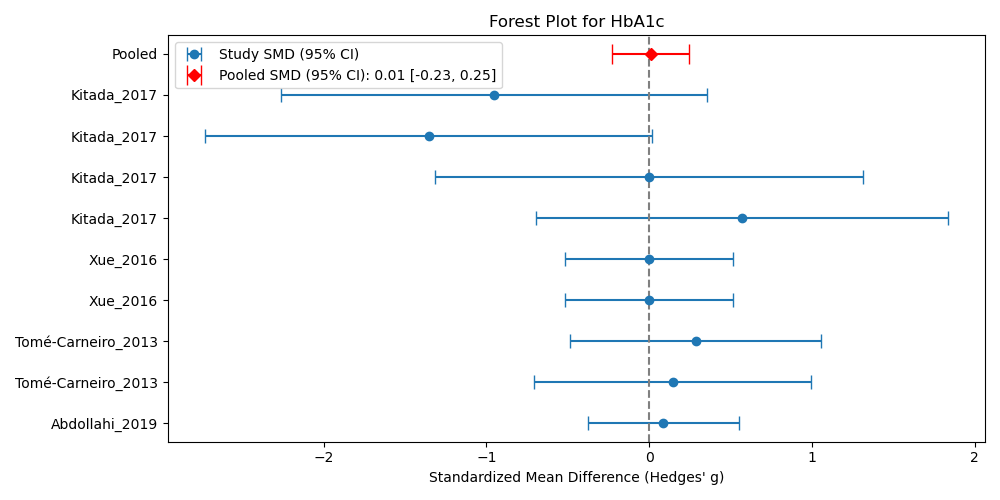

# Meta-Analysis Project Documentation

*Generated on: 2025-10-21 22:35:30*

**Creator:** krisztian.sugar@frogs.hu "budapest" team

## 1. Input Topic

**Topic:** Resveratrol supplementation and type 2 diabetes: a systematic review and meta-analysis

## 2. Database Search

Due to missing license I was only using PubMed API.

**Search queries generated by LLM:**
1. `(Resveratrol OR trans-Resveratrol OR 3,5,4'-trihydroxystilbene OR stilbene) AND ("Diabetes Mellitus, Type 2" OR T2DM OR "Insulin Resistance" OR hyperglycemia OR "Impaired Glucose Tolerance" OR prediabetes) NOT ("systematic review"[Publication Type] OR "meta-analysis"[Publication Type] OR "review"[Publication Type])`
2. `("Resveratrol"[MeSH] AND "Diabetes Mellitus, Type 2"[MeSH]) AND ("Clinical Trial"[Publication Type] OR "Randomized Controlled Trial"[Publication Type] OR "Controlled Study"[Publication Type]) NOT ("systematic review"[Publication Type] OR "meta-analysis"[Publication Type] OR "review"[Publication Type])`
3. `(resveratrol[tiab] AND (HbA1c[tiab] OR HOMA-IR[tiab] OR "insulin sensitivity"[tiab] OR "glucose control"[tiab])) NOT ("systematic review"[Publication Type] OR "meta-analysis"[Publication Type] OR "review"[Publication Type])`
4. `(Resveratrol AND Supplementation AND (T2DM OR NIDDM OR prediabetes)) AND (Humans[Mesh]) NOT ("systematic review"[Publication Type] OR "meta-analysis"[Publication Type] OR "review"[Publication Type])`
5. `(Resveratrol OR SRT501) AND ("Insulin Resistance" OR "Oxidative Stress" OR "SIRT1" OR "Glucose Metabolism") NOT ("systematic review"[Publication Type] OR "meta-analysis"[Publication Type] OR "review"[Publication Type])`
6. `(Resveratrol AND T2DM) AND ("randomized controlled trial"[pt] OR "clinical trial"[pt]) AND (2010:2024[dp]) NOT ("systematic review"[Publication Type] OR "meta-analysis"[Publication Type] OR "review"[Publication Type])`
7. `("3,5,4'-trihydroxystilbene" OR "Resveratrol formulation") AND (T2DM OR NIDDM) NOT ("systematic review"[Publication Type] OR "meta-analysis"[Publication Type] OR "review"[Publication Type])`

**Search results:** 281 articles retrieved

## 3. Abstract-Based Pre-filtering

Based on fetched PubMed metadata, articles were pre-filtered using LLM analysis of abstracts.

**GOOD CANDIDATES should have:**
- Clear randomized controlled trial (RCT) or systematic review methodology
- Well-defined study population and intervention
- Measurable primary and secondary outcomes
- Statistical analysis with effect sizes, confidence intervals, or p-values
- Clinical relevance and significance
- Adequate sample size
- Clear inclusion/exclusion criteria

**BAD CANDIDATES typically have:**
- Case reports or case series (small n<10)
- Editorial comments, letters, or opinions
- Animal studies or in vitro studies only
- Lack of control groups
- Unclear methodology or outcomes
- Preliminary or pilot studies without sufficient power
- Studies with major methodological flaws
- Conference abstracts without full methodology

**Result:** 39 articles remained after abstract filtering

## 4. Full-Text Article Download

As lack of license only publicly available open access articles were downloaded.
Download attempted using PubMed API, with fallback to DOI link following.

**Result:** 31 articles successfully downloaded

## 5. Article Classification

Remaining full-text articles were classified one-by-one using LLM analysis:

**Classification categories:**
- `article_type`: Article type classification
- `candidate_meta_analysis`: Suitability for meta-analysis
- `cochrane_bias`: Cochrane bias risk assessment
- `data_type`: Type of data presented
- `species`: Species studied
- `study_type`: Study design type
- `clinical_test`: Clinical tests/measurements
- `cohort`: Cohort characteristics

Each classification includes evidence references from the source text.

## 6. Meta-Analysis Target Selection

Based on available cohorts and clinical tests, LLM analysis identified:
*"The most suitable clinical test for meta-analysis — one that provides the strongest evidence base and the widest coverage across studies."*

Due to limited time and resources, only 1 meta-analysis target was selected.

**Selected target:**
<code>json
{
  "selected_clinical_test": "Glycated Hemoglobin (HbA1c)",
  "justification": "HbA1c is a standardized, clinically vital marker for long-term glycemic control, frequently reported across the studies, especially those involving Type 2 Diabetes. Its stability and relevance make it an excellent primary outcome for meta-analysis, superior to more volatile measures like fasting glucose.",
  "recommended_cohorts": [
    "Patients with Type 2 Diabetes (Resveratrol Intervention)",
    "Patients with Type 2 Diabetes (Placebo Control)",
    "Overweight/Obese Individuals with Metabolic Dysfunction"
  ]
}
</code>

## 7. Data Point Extraction

Based on the suggested meta-analysis target, all PDFs were processed individually to extract relevant data using multimodal Pro LLM.

**Sample extracted datapoints:**
<code>
 study_id    author_year  country population_type  sample_size_intervention  sample_size_control intervention_name  dose_mg_per_day  duration_days outcome_name biomarker_unit  intervention_baseline_mean  intervention_baseline_sd  intervention_post_mean  intervention_post_sd  control_baseline_mean  control_baseline_sd  control_post_mean  control_post_sd  mean_difference  sd_difference  p_value effect_direction statistical_significance
 35240291 Mahjabeen_2022 Pakistan  Type2_Diabetes                        55                   55       Resveratrol            200.0            168        HbA1c        percent                        8.64                      1.34                     8.2                   NaN                    8.4                 1.15               8.42              NaN            -0.45            NaN    0.033         decrease                      yes
 30237505        Bo_2018    Italy  Type2_Diabetes                        65                   62       Resveratrol            500.0            180        HbA1c        percent                        6.90                      1.20                     NaN                   NaN                    6.9                 1.00                NaN              NaN              NaN            NaN      NaN              NaN                      NaN
 30237505        Bo_2018    Italy  Type2_Diabetes                        65                   62       Resveratrol             40.0            180        HbA1c        percent                        7.20                      1.30                     NaN                   NaN                    6.9                 1.00                NaN              NaN              NaN            NaN      NaN              NaN                      NaN
</code>

## 8. Meta-Analysis Execution

LLM generated Python code to create Forest plots and statistical tables for the meta-analysis.

## 9. Cochrane Bias Risk Assessment

| PMID | Author Year | Randomization | Deviations | Missing Data | Measurement | Selection |
|------|-------------|---------------|------------|--------------|-------------|----------|
| 35240291 | Mahjabeen_2022 | False | False | False | False | False |
| 30237505 | Bo_2018 | False | False | True | False | False |
| 29914666 | Khodabandehloo_2018 | False | False | True | False | False |
| 29357033 | Seyyedebrahimi_2018 | False | False | False | False | False |
| 32144833 | Tabatabaie_2020 | False | False | False | False | False |
| 27520400 | Bo_2016 | False | False | False | False | False |
| 31475415 | Abdollahi_2019 | False | True | False | False | False |
| 23557933 | Tomé-Carneiro_2013 | True | False | False | False | False |
| 27207552 | Xue_2016 | True | False | False | False | True |
| 29057795 | Kitada_2017 | True | False | True | False | False |

## 10. Results

**Topic:** Resveratrol supplementation and type 2 diabetes: a systematic review and meta-analysis

**Generated visualizations:**

**Statistical Results:**
<code>
Successfully loaded 17 rows from _extracted_datapoints.csv
Columns: ['study_id', 'author_year', 'country', 'population_type', 'sample_size_intervention', 'sample_size_control', 'intervention_name', 'dose_mg_per_day', 'duration_days', 'outcome_name', 'biomarker_unit', 'intervention_baseline_mean', 'intervention_baseline_sd', 'intervention_post_mean', 'intervention_post_sd', 'control_baseline_mean', 'control_baseline_sd', 'control_post_mean', 'control_post_sd', 'mean_difference', 'sd_difference', 'p_value', 'effect_direction', 'statistical_significance']
Outcomes available: ['HbA1c']
Studies: ['Mahjabeen_2022' 'Bo_2018' 'Khodabandehloo_2018' 'Seyyedebrahimi_2018'
 'Tabatabaie_2020' 'Bo_2016' 'Abdollahi_2019' 'Tomé-Carneiro_2013'
 'Xue_2016' 'Kitada_2017']

After cleaning missing values: 9 rows remaining
Outcomes with multiple studies: ['HbA1c']

==================================================
GENERATED CHARTS
==================================================
--- Meta-analysis for HbA1c ---
           author_year       intervention_name  dose_mg_per_day         g      se_g
8       Abdollahi_2019             Resveratrol          1000.00  0.087130  0.237492
9   Tomé-Carneiro_2013             Resveratrol            12.15  0.145445  0.434183
10  Tomé-Carneiro_2013             Resveratrol            12.15  0.285185  0.394221
11            Xue_2016  Resveratrol+Hesperetin            90.00  0.000000  0.262613
12            Xue_2016  Resveratrol+Hesperetin            90.00  0.000000  0.262613
13         Kitada_2017             Piceatannol            20.00  0.571250  0.645226
14         Kitada_2017             Piceatannol            20.00  0.000000  0.670820
15         Kitada_2017             Piceatannol            20.00 -1.354839  0.701270
16         Kitada_2017             Piceatannol            20.00 -0.952084  0.667325
Pooled SMD (Hedges' g): 0.009
Standard Error of Pooled SMD: 0.122
95% CI: [-0.229, 0.248]

Chart: Forest Plot - HbA1c
Filename: _meta_analysis_forest_HbA1c.png
Description: Forest plot showing standardized mean differences for HbA1c with 95% confidence intervals
-----------------------------
</code>

